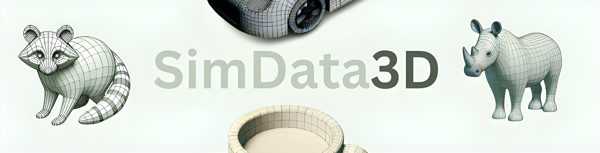

# SimData3D Dataset



A filtered down dataset of the [cap3d](https://cap3d-um.github.io/) dataset, now containing only the most simple and quality of objects.

## Overview

This project provides a script to filter captions from the `cap3d` dataset to remove 3D objects that contain many sub-objects. 
[GLiNER](https://github.com/urchade/GLiNER) was used for NER to capture the number of objects within text (with max threshold of <=2). The filter script can be found in the [filtered folder](https://github.com/RaccoonResearch/simdata/tree/main/filtered)

## Requirements

This `install.sh` script will install [GLiNER](https://github.com/urchade/GLiNER). Make sure the script has executable permissions. You can set executable permissions with:

```bash
chmod +x install.sh
./install.sh
```

## Clone

1. Clone the repository and navigate to the project directory:

```bash
git clone https://github.com/RaccoonResearch/simdata
cd simdata
```
